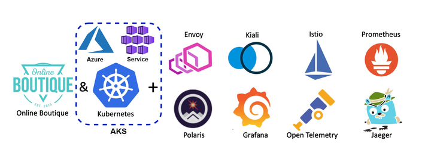

# Azure AKS Scaler

## Setting Workload Identity

> [Tutorial: Use a workload identity with an application on Azure Kubernetes Service (AKS)](https://learn.microsoft.com/en-us/azure/aks/learn/tutorial-kubernetes-workload-identity)

### Create an OpenID Connect provider on Azure Kubernetes Service (AKS)
> [Create an OpenID Connect provider on Azure Kubernetes Service (AKS)](https://learn.microsoft.com/en-us/azure/aks/use-oidc-issuer)

1. Update an AKS cluster with OIDC Issuer  
`az aks update -g myResourceGroup -n myAKSCluster --enable-oidc-issuer`

2. Show the OIDC Issuer URL  
`az aks show -n myAKScluster -g myResourceGroup --query "oidcIssuerProfile.issuerUrl" -otsv`

3. Get the OIDC Issuer URL and save it to an environmental variable  
`export AKS_OIDC_ISSUER="$(az aks show -n myAKSCluster -g "${RESOURCE_GROUP}" --query "oidcIssuerProfile.issuerUrl" -otsv)"`

### Export environmental variables

`export RESOURCE_GROUP="myResourceGroup" \`   
`export LOCATION="westcentralus" \`  
`export CLUSTER_NAME="myManagedCluster" \`  
`export SERVICE_ACCOUNT_NAMESPACE="default" \`  
`export SERVICE_ACCOUNT_NAME="workload-identity-sa" \`  
`export SUBSCRIPTION="$(az account show --query id --output tsv)" \`  
`export USER_ASSIGNED_IDENTITY_NAME="userIdentity" \`  
`export FEDERATED_IDENTITY_CREDENTIAL_NAME="scalerFedIdentity"`

### Create a managed identity and grant permissions to access AKS api-controller
> [Assign a managed identity access to a resource using Azure CLI](https://learn.microsoft.com/en-us/azure/active-directory/managed-identities-azure-resources/howto-assign-access-cli)
> [Use a managed identity in Azure Kubernetes Service (AKS)](https://learn.microsoft.com/en-us/azure/aks/use-managed-identity)

1. Create a managed identity using the [az identity create](https://learn.microsoft.com/en-us/cli/azure/identity#az-identity-create) command.  
`az identity create --name "${USER_ASSIGNED_IDENTITY_NAME}" --resource-group "${RESOURCE_GROUP}" --location "${LOCATION}" --subscription "${SUBSCRIPTION}"`

2. Set the CLIENT_ID environment variable  
`export USER_ASSIGNED_CLIENT_ID="$(az identity show --resource-group "${RESOURCE_GROUP}" --name "${USER_ASSIGNED_IDENTITY_NAME}" --query 'clientId' -otsv)"`

3. Get credentials to access the cluster using the [az aks get-credentials](https://learn.microsoft.com/en-us/cli/azure/aks#az_aks_get_credentials) command.  
`az aks get-credentials --resource-group "${RESOURCE_GROUP}" --name "${CLUSTER_NAME}"`

4. To update your existing AKS cluster that's using a service principal to use a system-assigned managed identity, run the [az aks update](https://learn.microsoft.com/en-us/cli/azure/aks#az_aks_update) command  
`az aks update -g myResourceGroup -n myManagedCluster --enable-managed-identity`
