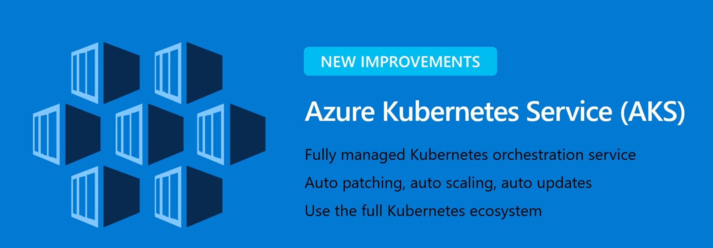

*Azure AKS Scaler*
# Azure Kubernetes Service (AKS) Workload Identity
> Azure Kubernetes Service (AKS) Workload Identity is a feature that allows Kubernetes pods to authenticate with Azure services using their own identities, instead of using a service principal. This provides a more secure and streamlined way to access Azure resources from within a Kubernetes cluster.  
>
> *Based on*:
> [Tutorial: Use a workload identity with an application on Azure Kubernetes Service (AKS)](https://learn.microsoft.com/en-us/azure/aks/learn/tutorial-kubernetes-workload-identity)
> [Getting started - Managing Container Service using Azure Python SDK](https://learn.microsoft.com/en-us/samples/azure-samples/azure-samples-python-management/containerservice/)

### How does Workload Identity works
In this security model, the AKS cluster acts as token issuer, Azure Active Directory uses OpenID Connect to discover public signing keys and verify the authenticity of the service account token before exchanging it for an Azure AD token. Your workload can exchange a service account token projected to its volume for an Azure AD token using the Azure Identity client library or the Microsoft Authentication Library.

[](https://learn.microsoft.com/en-us/azure/aks/workload-identity-overview?tabs=python)


### In this article

&nbsp;&nbsp;&nbsp;&nbsp;[Prepare the environment](#first)  
&nbsp;&nbsp;&nbsp;&nbsp;[Enable OpenID Connect (OIDC) provider on existing AKS cluster](#second)  
&nbsp;&nbsp;&nbsp;&nbsp;[Create a managed identity and grant permissions to access AKS control plane](#third)  
&nbsp;&nbsp;&nbsp;&nbsp;[Create Kubernetes service account](#forth)  
&nbsp;&nbsp;&nbsp;&nbsp;[Establish federated identity credential](#fifth)  
&nbsp;&nbsp;&nbsp;&nbsp;[Prepare the container image](#sixth)  
&nbsp;&nbsp;&nbsp;&nbsp;[Deploy the workload](#seventh)  
&nbsp;&nbsp;&nbsp;&nbsp;[Deploy using GitHub action](#seventha)  


##### Prerequisites

 * If you don't have an [Azure subscription](https://learn.microsoft.com/en-us/azure/guides/developer/azure-developer-guide#understanding-accounts-subscriptions-and-billing), create an [Azure free account](https://azure.microsoft.com/free/?ref=microsoft.com&utm_source=microsoft.com&utm_medium=docs&utm_campaign=visualstudio) before you begin.  
* AKS supports Azure AD workload identities on version 1.22 and higher.
* The Azure CLI version 2.47.0 or later. Run az --version to find the version, and run az upgrade to upgrade the version. If you need to install or upgrade, see [Install Azure CLI](https://learn.microsoft.com/en-us/cli/azure/install-azure-cli).
* The identity you use to create your cluster must have the appropriate minimum permissions. For more information on access and identity for AKS, see Access and identity options for [Azure Kubernetes Service (AKS)](https://learn.microsoft.com/en-us/azure/aks/concepts-identity).  
* If you have multiple Azure subscriptions, select the appropriate subscription ID in which the resources should be billed using the [az account](https://learn.microsoft.com/en-us/cli/azure/account) command.


---

#### <a name="first"></a>Prepare the environment  
##### Export environment variables  

Static initalized Variables:  

```
export RESOURCE_GROUP="myResourceGroup" \  
export LOCATION="westcentralus" \  
export CLUSTER_NAME="myManagedCluster" \  
export SERVICE_ACCOUNT_NAMESPACE="default" \  
export SERVICE_ACCOUNT_NAME="workload-identity-sa" \  
export ASSIGNED_MANAGED_IDENTITY_NAME="aksSkalerIdentity" \  
export FEDERATED_IDENTITY_CREDENTIAL_NAME="scalerFedIdentity" \  
export ACR_NAME=acr4aksregistry  
```
<!-- export ASSIGNED_MANAGED_IDENTITY_PRINCIPAL_ID="$(az identity show --ids /subscriptions/"${SUBSCRIPTION_ID}"/resourceGroups/"${RESOURCE_GROUP}"/providers/Microsoft.ManagedIdentity/userAssignedIdentities/"${ASSIGNED_MANAGED_IDENTITY_NAME}" --query principalId)" \   -->


Variables generated in the process:  
```
export ASSIGNED_MANAGED_IDENTITY_CLIENT_ID="$(az identity show --resource-group "${RESOURCE_GROUP}" --name "${ASSIGNED_MANAGED_IDENTITY_NAME}" --query 'clientId' -otsv)" \  
export AKS_OIDC_ISSUER="$(az aks show -n myAKSCluster -g "${RESOURCE_GROUP}" --query "oidcIssuerProfile.issuerUrl" -otsv)" \  
```

App Registration Variables:  
```
export AZURE_TENANT_ID=$(az account show --query tenantId -o tsv) \  
export SUBSCRIPTION_ID="$(az account show --query id --output tsv)" \  
export AZURE_CLIENT_ID="<from app registration>" \  
export AZURE_CLIENT_SECRET="<from app registration>" \  
```

##### Login to Azure    

Before using any Azure CLI commands with a local install, you need to sign in with [az login](https://learn.microsoft.com/en-us/cli/azure/reference-index#az-login).  

`az login`

#### <a name="second"></a>Enable OpenID Connect (OIDC) provider on existing AKS cluster  
> [OpenID Connect (OIDC)](https://learn.microsoft.com/en-us/azure/active-directory/fundamentals/auth-oidc) extends OAuth 2.0 for authentication via Azure AD. It enables SSO on Azure Kubernetes Service (AKS) using an ID token. AKS can automatically rotate keys or do it manually. Token lifetime is one day.
> This section teaches you how to create, update, and manage the OIDC Issuer for your cluster.
>
> **Warning**: Enabling OIDC Issuer on an existing cluster may cause downtime and API server restarts. If app pods fail, manually restart them.
> 
> **Important**: Once enabled, OIDC cannot be disabled.
> **Further Reading**: [Create an OpenID Connect provider on Azure Kubernetes Service (AKS)](https://learn.microsoft.com/en-us/azure/aks/use-oidc-issuer)

1. Update an AKS cluster with OIDC Issuer:  
`az aks update -g "${RESOURCE_GROUP}" -n "${CLUSTER_NAME}" --enable-oidc-issuer`

2. Show the OIDC Issuer URL:  
`az aks show -n "${CLUSTER_NAME}" -g "${RESOURCE_GROUP}" --query "oidcIssuerProfile.issuerUrl" -otsv`

3. Get the OIDC Issuer URL and save it to an environmental variable:  
`export AKS_OIDC_ISSUER="$(az aks show -n "${CLUSTER_NAME}" -g "${RESOURCE_GROUP}" --query "oidcIssuerProfile.issuerUrl" -otsv)"`

#### <a name="third"></a>Create a managed identity and grant permissions to access AKS control plane
> Azure Kubernetes Service (AKS) needs an identity for accessing Azure resources like load balancers and disks, which can be a [managed identity](https://learn.microsoft.com/en-us/azure/active-directory/managed-identities-azure-resources/overview) or service principal. A system-assigned managed identity is auto-generated and managed by Azure, while a [service principal](https://learn.microsoft.com/en-us/azure/aks/kubernetes-service-principal) must be created manually. Service principals expire and require renewal, making managed identities a simpler choice. Both have the same permission requirements and use certificate-based authentication. Managed identities have 90-day credentials that roll every 45 days. AKS supports both system-assigned and user-assigned managed identities, which are immutable.  
> **Further Reading**:
> [Assign a managed identity access to a resource using Azure CLI](https://learn.microsoft.com/en-us/azure/active-directory/managed-identities-azure-resources/howto-assign-access-cli)
> [Use a managed identity in Azure Kubernetes Service (AKS)](https://learn.microsoft.com/en-us/azure/aks/use-managed-identity)

1. Create a managed identity using the [az identity create](https://learn.microsoft.com/en-us/cli/azure/identity#az-identity-create) command:  
`az identity create --name "${ASSIGNED_MANAGED_IDENTITY_NAME}" --resource-group "${RESOURCE_GROUP}" --location "${LOCATION}" --subscription "${SUBSCRIPTION_ID}"`

2. Set the CLIENT_ID environment variable:  
`export ASSIGNED_MANAGED_IDENTITY_CLIENT_ID="$(az identity show --resource-group "${RESOURCE_GROUP}" --name "${ASSIGNED_MANAGED_IDENTITY_NAME}" --query 'clientId' -otsv)"`

3. Get credentials to access the cluster using the [az aks get-credentials](https://learn.microsoft.com/en-us/cli/azure/aks?view=azure-cli-latest#az-aks-get-credentials()) command,  
   By default, the credentials are merged into the .kube/config file so kubectl can use them:  
`az aks get-credentials --resource-group "${RESOURCE_GROUP}" --name "${CLUSTER_NAME}"`

4. Enable managed identities on an existing AKS cluster, Update current cluster to managed identity to manage cluster resource group (default value: False).
   To update your existing AKS cluster that's using a service principal to use a system-assigned managed identity, run the [az aks update](https://learn.microsoft.com/en-us/cli/azure/aks#az_aks_update) command:  
`az aks update -g "${RESOURCE_GROUP}" -n "${CLUSTER_NAME}" --enable-managed-identity`
5. Add role assignment, Assign the Managed Identity Operator role on the kubelet identity using the [az role assignment create](https://learn.microsoft.com/en-us/cli/azure/role/assignment#az_role_assignment_create) command:    

```
az role assignment create --assignee "${ASSIGNED_MANAGED_IDENTITY_PRINCIPAL_ID}" --role "Azure Kubernetes Service RBAC Cluster Admin" --scope "/subscriptions/${SUBSCRIPTION_ID}/resourceGroups/${RESOURCE_GROUP}/providers/Microsoft.ContainerService/managedClusters/${CLUSTER_NAME}"
```

<!-- `az role assignment create --assignee ${ASSIGNED_MANAGED_IDENTITY_NAME} --role "Azure Kubernetes Service RBAC Cluster Admin" --scope "/subscriptions/"${SUBSCRIPTION_ID}"/resourceGroups/"${RESOURCE_GROUP}"/providers/Microsoft.ContainerService/managedClusters/${CLUSTER_NAME}"` -->

<!-- 5. Get the principal ID of managed identity using the [az identity show](https://learn.microsoft.com/en-us/cli/azure/identity#az_identity_show) command.
`ASSIGNED_MANAGED_IDENTITY_PRINCIPAL_ID=$(az identity show --ids /subscriptions/"${SUBSCRIPTION_ID}"/resourceGroups/"${RESOURCE_GROUP}"/providers/Microsoft.ManagedIdentity/userAssignedIdentities/"${ASSIGNED_MANAGED_IDENTITY_NAME}" --query principalId)` -->


> **Following the principle of lease priviliges we will try to give less permissions by using custom roles, in this case we will use the builtin *Azure Kubernetes Service RBAC Cluster Admin* role**.  
 


#### <a name="forth"></a>Create Kubernetes service account  

1. Create a Kubernetes service account and annotate it with the client ID of the managed identity created in the previous step using the [az aks get-credentials](https://learn.microsoft.com/en-us/cli/azure/aks#az-aks-get-credentials) command. Replace the default value for the cluster name and the resource group name.  
`az aks get-credentials -n "${CLUSTER_NAME}" -g "${RESOURCE_GROUP}"`  

2. Copy the following multi-line input into your terminal and run the command to create the service account.  
`cat <<EOF | kubectl apply -f -
apiVersion: v1
kind: ServiceAccount
metadata:
  annotations:
    azure.workload.identity/client-id: ${ASSIGNED_MANAGED_IDENTITY_CLIENT_ID}
  name: ${SERVICE_ACCOUNT_NAME}
  namespace: ${SERVICE_ACCOUNT_NAMESPACE}
EOF`  
***Output:*** 
    `Serviceaccount/workload-identity-sa created`  

#### <a name="fifth"></a>Establish federated identity credential  
<!-- 1. Get the OIDC Issuer URL and save it to an environmental variable using the following command. Replace the default value for the arguments -n, which is the name of the cluster.  
`export AKS_OIDC_ISSUER="$(az aks show -n "${CLUSTER_NAME}" -g "${RESOURCE_GROUP}" --query "oidcIssuerProfile.issuerUrl" -otsv)"` -->
1. Create the federated identity credential between the managed identity, service account issuer, and subject using the [az identity federated-credential create](https://learn.microsoft.com/en-us/cli/azure/identity/federated-credential#az-identity-federated-credential-create) command.
`az identity federated-credential create --name ${FEDERATED_IDENTITY_CREDENTIAL_NAME} --identity-name ${ASSIGNED_MANAGED_IDENTITY_NAME} --resource-group ${RESOURCE_GROUP} --issuer ${AKS_OIDC_ISSUER} --subject system:serviceaccount:${SERVICE_ACCOUNT_NAMESPACE}:${SERVICE_ACCOUNT_NAME}`  
***Output:***  
The variable should contain the *Issuer URL* similar to the following example, By default, the Issuer is set to use the base URL https://{region}.oic.prod-aks.azure.com, where the value for {region} matches the location the AKS cluster is deployed in:
    <span>https://eastus.oic.prod-aks.azure.com/00000000-0000-0000-0000-000000000000/00000000-0000-0000-0000-000000000000/</span>

#### <a name="sixth"></a>Prepare the container image  
1. Configure ACR integration for an existing AKS cluster, Attach an ACR to an existing AKS cluster.
> Integrate an existing ACR with an existing AKS cluster using the [az aks update](https://learn.microsoft.com/en-us/cli/azure/aks#az-aks-update) command with the [--attach-acr parameter](https://learn.microsoft.com/en-us/cli/azure/aks#az-aks-update-optional-parameters) and a valid value for acr-name or acr-resource-id. more details [here](https://learn.microsoft.com/en-us/azure/aks/cluster-container-registry-integration?tabs=azure-cli#configure-acr-integration-for-an-existing-aks-cluster).  

```
# Attach using acr-name
az aks update -n ${CLUSTER_NAME} -g ${RESOURCE_GROUP} --attach-acr ${ACR_NAME}

# Attach using acr-resource-id
az aks update -n ${CLUSTER_NAME} -g ${RESOURCE_GROUP} --attach-acr <acr-resource-id>
```

2. Log in to a registry, The recommended method when working in a command line is with the Azure CLI command az acr login. For example, to access a registry named myregistry, sign in the Azure CLI and then authenticate to your registry:

`az acr login --name ${ACR_NAME} --expose-token`

3. Build and push image from a Dockerfile 
> Run the [az acr build](https://learn.microsoft.com/en-us/cli/azure/acr#az_acr_build) command, which builds the image and, after the image is successfully built, pushes it to your registry. The following example builds and pushes the aks-skaler:latest image. The . at the end of the command sets the location of the Dockerfile, in this case the current directory.

```
az acr build --image aks-skaler:latest --registry ${ACR_NAME} --file Dockerfile .
```

<!-- az acr build \
  --image aks-skaler:latest \
  --registry ${ACR_NAME} \
  --build-arg SUBSCRIPTION_ID=${SUBSCRIPTION_ID} \
  --build-arg NODE_POOLS_AMOUNT='{"manualpool2": 5, "manualpool3": 5}' \
  --build-arg RESOURCE_GROUP=${RESOURCE_GROUP} \
  --build-arg CLUSTER_NAME=${CLUSTER_NAME} \
  --file Dockerfile . -->

#### <a name="seventh"></a>Deploy the workload  

1. Deploy a pod that references the service account created in the previous step using the following command.

```
cat <<EOF | kubectl apply -f -
apiVersion: apps/v1
kind: Deployment
metadata:
  name: aks-scaler-deployment
  namespace: ${SERVICE_ACCOUNT_NAMESPACE}
  labels:
    azure.workload.identity/use: "true"
spec:
  replicas: 1
  selector:
    matchLabels:
      app: aks-scaler
  template:
    metadata:
      labels:
        app: aks-scaler
    spec:
      serviceAccountName: ${SERVICE_ACCOUNT_NAME}
      containers:
        - image: ${ACR_NAME}.azurecr.io/aks-skaler:latest
          name: oidc
          env:
          - name: SUBSCRIPTION_ID
            value: ${SUBSCRIPTION_ID}
          - name: NODE_POOLS_AMOUNT
            value: "{ \"manualpool2\": 5, \"manualpool3\": 5 }"
          - name: RESOURCE_GROUP
            value: ${RESOURCE_GROUP}
          - name: LOCATION
            value: ${LOCATION}
          - name: CLUSTER_NAME
            value: ${CLUSTER_NAME}
      nodeSelector:
        kubernetes.io/os: linux

EOF
```

#### <a name="seventha"></a>Deploy using GitHub action    
> The Deploy to AKS (main.yaml) GitHub Action that uses the [aks-scaler-deployment.yaml](https://github.com/eladtpro/azure-aks-scaler/blob/main/.github/workflows/main.yml) file to deploy to an Azure AKS cluster:
>
> This GitHub Action is triggered on pushes to the main branch. It checks out the code, logs in to Azure using the AZURE_CREDENTIALS secret, sets up kubectl using the KUBECONFIG secret, and then deploys the aks-scaler-deployment.yaml file to the AKS cluster using kubectl apply.
>
> To use this GitHub Action, you'll need to create the AZURE_CREDENTIALS and KUBECONFIG secrets in your repository. The AZURE_CREDENTIALS secret should contain your Azure service principal credentials in JSON format, and the KUBECONFIG secret should contain the contents of your Kubernetes configuration file.

1. You can create these secrets in your repository by going to the "Settings" tab, clicking on "Secrets", and then clicking on "New repository secret".
To create the *AZURE_CREDENTIALS* and KUBECONFIG secrets in your GitHub repository, you can follow these steps:
     1. Open your GitHub repository in a web browser.
     2. Click on the "Settings" tab.
     3. Click on "Secrets" in the left-hand menu.
     4. Click on "New repository secret".
     5. In the "Name" field, enter *AZURE_CREDENTIALS*.
     6. In the "Value" field, paste the contents of your Azure service principal credentials JSON file.
     7. Click on "Add secret".
     8. Click on "New repository secret" again.
     9. In the "Name" field, enter *KUBECONFIG*.
     10. In the "Value" field, paste the contents of your Kubernetes configuration file.
     11. Click on "Add secret".
2. Get the *AZURE_CREDENTIALS* value, We will create a service principal and configure its access to Azure resources using the [az ad sp create-for-rbac](https://learn.microsoft.com/en-us/cli/azure/ad/sp?view=azure-cli-latest#az-ad-sp-create-for-rbac()).
The output includes credentials that you must protect. Be sure that you do not include these credentials in your code or check the credentials into your source control. As an alternative, consider using managed identities if available to avoid the need to use credentials.  

```
az ad sp create-for-rbac --name aks-scaler --role contributor --scopes /subscriptions/${SUBSCRIPTION_ID}/resourceGroups/${RESOURCE_GROUP}

az ad sp create-for-rbac --name aks-scaler --role "Azure Kubernetes Service RBAC Cluster Admin" --scopes /subscriptions/${SUBSCRIPTION_ID}/resourceGroups/${RESOURCE_GROUP}/providers/Microsoft.ContainerService/managedClusters/${CLUSTER_NAME}
```  


***Output:***  
    ```
    {
      "clientId": "00000000-0000-0000-0000-000000000000",
      "clientSecret": "<SECRET>",
      "subscriptionId": "00000000-0000-0000-0000-000000000000",
      "tenantId": "00000000-0000-0000-0000-000000000000",
      "activeDirectoryEndpointUrl": "https://login.microsoftonline.com",
      "resourceManagerEndpointUrl": "https://management.azure.com/",
      "activeDirectoryGraphResourceId": "https://graph.windows.net/",
      "sqlManagementEndpointUrl": "https://management.core.windows.net:8443/",
      "galleryEndpointUrl": "https://gallery.azure.com/",
      "managementEndpointUrl": "https://management.core.windows.net/"
    }
    ```

3. Get the *KUBECONFIG* secret value
   1. First, get the context name:  
   `kubectl config current-context`
   2. Getting the config value:
   `kubectl config view --minify --flatten --context=<CONTEXT_NAME>`

4. GitHub Action Variables, GitHub sets default variables for each GitHub Actions workflow run. You can also set custom variables for use in a single workflow or multiple workflows.
> Variables provide a way to store and reuse non-sensitive configuration information. You can store any configuration data such as compiler flags, usernames, or server names as variables. Variables are interpolated on the runner machine that runs your workflow. Commands that run in actions or workflow steps can create, read, and modify variables.

Variables can be accessed using the *vars* kewords, e.g *vars.RESOURCE_GROUP*, complete exsample in the action (workflow) file [main.yaml](https://github.com/eladtpro/azure-aks-scaler/blob/main/.github/workflows/main.yml)


---

## Further Reading:
[Use Azure AD workload identity with Azure Kubernetes Service (AKS)](https://learn.microsoft.com/en-us/azure/aks/workload-identity-overview?tabs=python)  
<sub>Workloads deployed on an Azure Kubernetes Services (AKS) cluster require Azure Active Directory (Azure AD) application credentials or managed identities to access Azure AD protected resources, such as Azure Key Vault and Microsoft Graph. Azure AD workload identity integrates with the capabilities native to Kubernetes to federate with external identity providers.</sub>

[What are workload identities?](https://learn.microsoft.com/en-us/azure/active-directory/workload-identities/workload-identities-overview)  
<sub>A workload identity is an identity you assign to a software workload (such as an application, service, script, or container) to authenticate and access other services and resources. The terminology is inconsistent across the industry, but generally a workload identity is something you need for your software entity to authenticate with some system. For example, in order for GitHub Actions to access Azure subscriptions the action needs a workload identity which has access to those subscriptions. A workload identity could also be an AWS service role attached to an EC2 instance with read-only access to an Amazon S3 bucket.
In Microsoft Entra, workload identities are applications, service principals, and managed identities.</sub>

[ServiceAccount token volume projection](https://kubernetes.io/docs/tasks/configure-pod-container/configure-service-account/#serviceaccount-token-volume-projection)  
<sub>The kubelet can also project a ServiceAccount token into a Pod. You can specify desired properties of the token, such as the audience and the validity duration. These properties are not configurable on the default ServiceAccount token. The token will also become invalid against the API when either the Pod or the ServiceAccount is deleted.</sub>

[Tutorial: Use a workload identity with an application on Azure Kubernetes Service (AKS)](https://learn.microsoft.com/en-us/azure/aks/learn/tutorial-kubernetes-workload-identity#create-a-managed-identity-and-grant-permissions-to-access-the-secret)  
<sub>Azure Kubernetes Service (AKS) is a managed Kubernetes service that lets you quickly deploy and manage Kubernetes clusters. In this tutorial, you:
Deploy an AKS cluster using the Azure CLI with OpenID Connect (OIDC) Issuer and managed identity.
Create an Azure Key Vault and secret.
Create an Azure Active Directory (Azure AD) workload identity and Kubernetes service account.
Configure the managed identity for token federation.
Deploy the workload and verify authentication with the workload identity.</sub>

[Assign a managed identity access to a resource using Azure CLI](https://learn.microsoft.com/en-us/azure/active-directory/managed-identities-azure-resources/howto-assign-access-cli#next-steps)  
<sub>Managed identities for Azure resources is a feature of Azure Active Directory. Each of the [Azure services that support managed identities for Azure resources](https://learn.microsoft.com/en-us/azure/active-directory/managed-identities-azure-resources/services-support-managed-identities) are subject to their own timeline. Make sure you review the [availability](https://learn.microsoft.com/en-us/azure/active-directory/managed-identities-azure-resources/services-support-managed-identities) status of managed identities for your resource and [known issues](https://learn.microsoft.com/en-us/azure/active-directory/managed-identities-azure-resources/known-issues) before you begin.</sub>

[Use a managed identity in Azure Kubernetes Service (AKS)](https://learn.microsoft.com/en-us/azure/aks/use-managed-identity)  
<sub>Azure Kubernetes Service (AKS) clusters require an identity to access Azure resources like load balancers and managed disks. This identity can be a managed identity or service principal. A system-assigned managed identity is automatically created when you create an AKS cluster. This identity is managed by the Azure platform and doesn't require you to provision or rotate any secrets. For more information about managed identities in Azure AD, see [Managed identities for Azure resources](https://learn.microsoft.com/en-us/azure/active-directory/managed-identities-azure-resources/overview).</sub>

[Authenticate with Azure Container Registry (ACR) from Azure Kubernetes Service (AKS)](https://learn.microsoft.com/en-us/azure/aks/cluster-container-registry-integration?tabs=azure-cli)
<sub>When using [Azure Container Registry (ACR)](https://learn.microsoft.com/en-us/azure/container-registry/container-registry-intro) with Azure Kubernetes Service (AKS), you need to establish an authentication mechanism. You can configure the required permissions between ACR and AKS using the Azure CLI, Azure PowerShell, or Azure portal. This article provides examples to configure authentication between these Azure services using the Azure CLI or Azure PowerShell.</sub>

[Push your first image to your Azure container registry using the Docker CLI](https://learn.microsoft.com/en-us/azure/container-registry/container-registry-get-started-docker-cli?tabs=azure-cli)  
<sub>An Azure container registry stores and manages private container images and other artifacts, similar to the way [Docker Hub](https://hub.docker.com/) stores public Docker container images. You can use the [Docker command-line interface](https://docs.docker.com/engine/reference/commandline/cli/) (Docker CLI) for [login](https://docs.docker.com/engine/reference/commandline/login/), [push](https://docs.docker.com/engine/reference/commandline/push/), [pull](https://docs.docker.com/engine/reference/commandline/pull/), and other container image operations on your container registry.</sub>

[Quickstart: Build and run a container image using Azure Container Registry Tasks](https://learn.microsoft.com/en-us/azure/container-registry/container-registry-quickstart-task-cli)  
<sub>In this quickstart, you use [Azure Container Registry Tasks](https://learn.microsoft.com/en-us/azure/container-registry/container-registry-tasks-overview) commands to quickly build, push, and run a Docker container image natively within Azure, without a local Docker installation. ACR Tasks is a suite of features within Azure Container Registry to help you manage and modify container images across the container lifecycle. This example shows how to offload your "inner-loop" container image development cycle to the cloud with on-demand builds using a local Dockerfile.</sub>