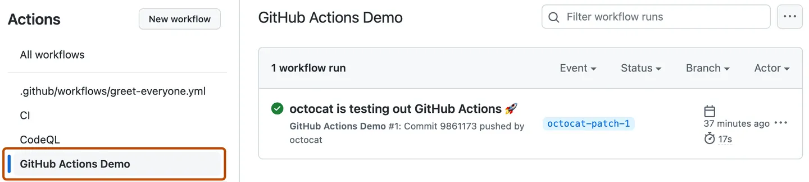

# Azure Kubernetes Service (AKS) *Workload Identity* Walkthrough
> Azure Kubernetes Service (AKS) Workload Identity is a feature that allows Kubernetes pods to authenticate with Azure services using their own identities, instead of using a service principal. This provides a more secure and streamlined way to access Azure resources from within a Kubernetes cluster.  
>

## In this article
| &nbsp;&nbsp;&nbsp;&nbsp;[How does Workload Identity work](#how)  
| &nbsp;&nbsp;&nbsp;&nbsp;[Identities](#ids)  
| &nbsp;&nbsp;&nbsp;&nbsp;[Initialize Variables](#first)  
| &nbsp;&nbsp;&nbsp;&nbsp;[Enable OpenID Connect (OIDC) provider on existing AKS cluster](#second)  
| &nbsp;&nbsp;&nbsp;&nbsp;[Create a managed identity and grant permissions to access the AKS control plane](#third)  
| &nbsp;&nbsp;&nbsp;&nbsp;[Create a Kubernetes service account](#forth)  
| &nbsp;&nbsp;&nbsp;&nbsp;[Establish federated identity credential](#fifth)  
| &nbsp;&nbsp;&nbsp;&nbsp;[Prepare the container image](#sixth)  
| &nbsp;&nbsp;&nbsp;&nbsp;[Deploy the workload (CLI)](#seventh)  
| &nbsp;&nbsp;&nbsp;&nbsp;[Test the app](#test)  
| &nbsp;&nbsp;&nbsp;&nbsp;[Local Development](#local)  
| &nbsp;&nbsp;&nbsp;&nbsp;[Deploy the workload (GitHub Actions)](#github)  


##### Prerequisites

* If you don't have an [Azure subscription](https://learn.microsoft.com/en-us/azure/guides/developer/azure-developer-guide#understanding-accounts-subscriptions-and-billing), create an [Azure free account](https://azure.microsoft.com/free/?ref=microsoft.com&utm_source=microsoft.com&utm_medium=docs&utm_campaign=visualstudio) before you begin.  
* AKS supports Azure AD workload identities on version 1.22 and higher.
* The Azure CLI version is 2.47.0 or later. Run az --version to find the version, and run az upgrade to upgrade the version. If you need to install or upgrade, see [Install Azure CLI](https://learn.microsoft.com/en-us/cli/azure/install-azure-cli).
* The identity you use to create your cluster must have the appropriate minimum permissions. For more information on access and identity for AKS, see Access and identity options for [Azure Kubernetes Service (AKS)](https://learn.microsoft.com/en-us/azure/aks/concepts-identity).  
* If you have multiple Azure subscriptions, select the appropriate subscription ID in which the resources should be billed using the [az account](https://learn.microsoft.com/en-us/cli/azure/account) command.
* Bash terminal

### <a name="how"></a>How does Workload Identity work  
In this security model, the AKS cluster acts as a token issuer, Azure Active Directory uses OpenID Connect to discover public signing keys and verify the authenticity of the service account token before exchanging it for an Azure AD token. Your workload can exchange a service account token projected to its volume for an Azure AD token using the Azure Identity client library or the Microsoft Authentication Library.  

[](https://learn.microsoft.com/en-us/azure/aks/workload-identity-overview?tabs=python)  

## Preps

###### Login to Azure    

Before using any Azure CLI commands with a local install, you need to sign in with [az login](https://learn.microsoft.com/en-us/cli/azure/reference-index#az-login).  

`az login`

### <a name="ids"></a>Identities  


This solution utilizes three types of identities, as listed in the table below.  
The first is the primary workload identity ***Managed Identity***, utilized by the AKS cluster, followed by its counterpart ***Service Principal*** for local development.  
Lastly, we have the identity as ***Application*** (App Registration) of the GitHub CI/CD workflow agent.  

| Aim | Kind | Role  | Scope  | Variable /Name     |
|---|---|---|---|---|
| [AKS pod Workload Identity](#third) | Managed Identity  service principal, user assigned identity| Azure Kubernetes Service RBAC Cluster Admin | AKS Cluster    | *ASSIGNED_MANAGED_IDENTITY_NAME* |
| [GitHub Actions](#github)             | Application service principal       | Contributor                                 | Resource Group | *AZURE_CREDENTIALS* |
| [Local Development](#local)          | Application service principal       | Azure Kubernetes Service RBAC Cluster Admin | AKS Cluster    | *aks-scaler* |

<!-- 
`az identity create --name "${ASSIGNED_MANAGED_IDENTITY_NAME}" --resource-group "${RESOURCE_GROUP}" --location "${LOCATION}" --subscription "${SUBSCRIPTION_ID}"`
`az ad app create --display-name aks-scaler` <br/> `az ad sp create --id $appId` <br/> `az role assignment create --role contributor --subscription ${SUBSCRIPTION_ID} --assignee-object-id  $assigneeObjectId --assignee-principal-type ServicePrincipal --scope /subscriptions/${SUBSCRIPTION_ID}/resourceGroups/"${RESOURCE_GROUP}"`
`az ad sp create-for-rbac --name aks-scaler --role contributor --scopes /subscriptions/${SUBSCRIPTION_ID}/resourceGroups/${RESOURCE_GROUP}/providers/Microsoft.ContainerService/managedClusters/${CLUSTER_NAME} --json-auth` <br/> or <br/> `az role assignment create --role contributor --subscription ${SUBSCRIPTION_ID} --assignee-object-id  $assigneeObjectId --assignee-principal-type ServicePrincipal --scope /subscriptions/${SUBSCRIPTION_ID}/resourceGroups/${RESOURCE_GROUP}/providers/Microsoft.ContainerService/managedClusters/${CLUSTER_NAME}` 
-->

> The az [ad sp create-for-rbac](https://learn.microsoft.com/en-us/cli/azure/ad/sp?view=azure-cli-latest#az-ad-sp-create-for-rbac()) and [az ad app create](https://learn.microsoft.com/en-us/cli/azure/ad/app?view=azure-cli-latest#az-ad-app-create()) commands in the Azure CLI serve different purposes and have distinct functionalities:
>
> 1. [`az ad sp create-for-rbac`](https://learn.microsoft.com/en-us/cli/azure/ad/sp?view=azure-cli-latest#az-ad-sp-create-for-rbac())  
> **Purpose**: Create a service principal and configure its access to Azure resources.
> **Functionality**: It creates a service principal, assigns it a role,  
and generates credentials (usually a client secret or certificate) that the application or service can use for authentication and authorization when interacting with Azure resources.  
> **Typical Use Case**: You use this command when you want to create a service principal specifically for granting permissions to your application or service to access Azure resources.  
>  
> 2. [`az ad app create`](https://learn.microsoft.com/en-us/cli/azure/ad/app?view=azure-cli-latest#az-ad-app-create())  
> **Purpose**: This command is used to create an Azure AD application registration.  
An application registration represents your custom application in Azure AD, and it's used to configure various aspects of your application's behavior, including authentication settings, permissions, and redirect URIs.  
**Functionality**: It creates an Azure AD application registration, which is not the same as a service principal.  
Application registration is a prerequisite for creating a service principal, and it defines the configuration and characteristics of your application within Azure AD.  
**Typical Use Case**: You use this command when you want to register your custom application with Azure AD.  
After registering the application, you can then create a service principal for it using the `az ad sp create --id $appId` command if you need to grant it specific permissions for Azure resources.  
>  
> **In summary**,  
The main difference is that `az ad sp create-for-rbac` is focused on creating a service principal specifically for RBAC and resource access,  
While `az ad app create` is focused on creating an application registration within Azure AD, which is a prerequisite for creating service principals and configuring other application-related settings.  

---

### <a name="first"></a>Initialize Variables  
###### Environment variables (used by the python app)

```
export SUBSCRIPTION_ID="$(az account show --query id -otsv)" \
export RESOURCE_GROUP="myResourceGroup" \
export CLUSTER_NAME="myManagedCluster" \
export NODE_POOLS_AMOUNT="{ \"manualpool2\": 5, \"manualpool3\": 5 }"
```

###### Azure Python SDK Variables (Local Development):  

```
export AZURE_TENANT_ID=$(az account show --query tenantId -otsv) \
export AZURE_CLIENT_ID="$(az ad app show --id <Application (client) ID>  --query 'appId' -otsv)" \
export AZURE_CLIENT_SECRET="<from app registration>" \
```


###### Custom variables:  

```
LOCATION="westcentralus" \
SERVICE_ACCOUNT_NAMESPACE="default" \
SERVICE_ACCOUNT_NAME="workload-identity-sa" \
ASSIGNED_MANAGED_IDENTITY_NAME="aksSkalerIdentity" \
FEDERATED_IDENTITY_CREDENTIAL_NAME="scalerFedIdentity" \
ACR_NAME=acr4aksregistry  
```

###### Variables generated in the process:  

```
ASSIGNED_MANAGED_IDENTITY_CLIENT_ID="$(az identity show --resource-group "${RESOURCE_GROUP}" --name "${ASSIGNED_MANAGED_IDENTITY_NAME}" --query 'clientId' -otsv)" \  
AKS_OIDC_ISSUER="$(az aks show -n ${CLUSTER_NAME} -g "${RESOURCE_GROUP}" --query "oidcIssuerProfile.issuerUrl" -otsv)" \  
KUBE_CONTEXT_NAME=$(kubectl config current-context)
```

> To change the output format to tab-separated values (TSV), add `-o tsv` (`--output tsv` or `-otsv`) to a command.  
> This format is useful for loading information into spreadsheets, or for other machine processing.  


### <a name="second"></a>Enable OpenID Connect (OIDC) provider on existing AKS cluster  
> [OpenID Connect (OIDC)](https://learn.microsoft.com/en-us/azure/active-directory/fundamentals/auth-oidc) extends OAuth 2.0 for authentication via Azure AD. It enables SSO on Azure Kubernetes Service (AKS) using an ID token. AKS can automatically rotate keys or do it manually. Token lifetime is one day.
> This section teaches you how to create, update, and manage the OIDC Issuer for your cluster.
>
> **Warning**: Enabling the OIDC Issuer on an existing cluster may cause downtime and API server restarts. If app pods fail, manually restart them.
> 
> **Important**: Once enabled, OIDC cannot be disabled.
> **Further Reading**: [Create an OpenID Connect provider on Azure Kubernetes Service (AKS)](https://learn.microsoft.com/en-us/azure/aks/use-oidc-issuer)

1. Update an AKS cluster with OIDC Issuer:  
```
az aks update -g "${RESOURCE_GROUP}" -n "${CLUSTER_NAME}" --enable-oidc-issuer
```

2. Show the OIDC Issuer URL:  
```
az aks show -n "${CLUSTER_NAME}" -g "${RESOURCE_GROUP}" --query "oidcIssuerProfile.issuerUrl" -otsv
```

3. Get the OIDC Issuer URL and save it to an environmental variable:  
```
export AKS_OIDC_ISSUER="$(az aks show -n "${CLUSTER_NAME}" -g "${RESOURCE_GROUP}" --query "oidcIssuerProfile.issuerUrl" -otsv)"
```

### <a name="third"></a>Create a managed identity and grant permissions to access the AKS control plane
> Azure Kubernetes Service (AKS) needs an identity for accessing Azure resources like load balancers and disks, which can be a [managed identity](https://learn.microsoft.com/en-us/azure/active-directory/managed-identities-azure-resources/overview) or service principal. A system-assigned managed identity is auto-generated and managed by Azure, while a [service principal](https://learn.microsoft.com/en-us/azure/aks/kubernetes-service-principal) must be created manually. Service principals expire and require renewal, making managed identities a simpler choice. Both have the same permission requirements and use certificate-based authentication. Managed identities have 90-day credentials that roll every 45 days. AKS supports both system-assigned and user-assigned managed identities, which are immutable.  
> **Further Reading**:
> [Assign a managed identity access to a resource using Azure CLI](https://learn.microsoft.com/en-us/azure/active-directory/managed-identities-azure-resources/howto-assign-access-cli)
> [Use a managed identity in Azure Kubernetes Service (AKS)](https://learn.microsoft.com/en-us/azure/aks/use-managed-identity)

1. Create a managed identity using the [az identity create](https://learn.microsoft.com/en-us/cli/azure/identity#az-identity-create) command:  
```
az identity create --name "${ASSIGNED_MANAGED_IDENTITY_NAME}" --resource-group "${RESOURCE_GROUP}" --location "${LOCATION}" --subscription "${SUBSCRIPTION_ID}"
```

2. Set the *CLIENT_ID* environment variable:  
```
export ASSIGNED_MANAGED_IDENTITY_CLIENT_ID="$(az identity show --resource-group "${RESOURCE_GROUP}" --name "${ASSIGNED_MANAGED_IDENTITY_NAME}" --query 'clientId' -otsv)"
```

3. Get credentials to access the cluster using the [az aks get-credentials](https://learn.microsoft.com/en-us/cli/azure/aks?view=azure-cli-latest#az-aks-get-credentials()) command,  
   By default, the credentials are merged into the .kube/config file so kubectl can use them:  
```
az aks get-credentials --resource-group "${RESOURCE_GROUP}" --name "${CLUSTER_NAME}"
```

4. Enable managed identities on an existing AKS cluster, Update current cluster to managed identity to manage cluster resource group (default value: False).
   To update your existing AKS cluster that's using a service principal to use a system-assigned managed identity, run the [az aks update](https://learn.microsoft.com/en-us/cli/azure/aks#az_aks_update) command:  
`az aks update -g "${RESOURCE_GROUP}" -n "${CLUSTER_NAME}" --enable-managed-identity`
5. Add role assignment, Assign the Managed Identity Operator role on the kubelet identity using the [az role assignment create](https://learn.microsoft.com/en-us/cli/azure/role/assignment#az_role_assignment_create) command:    

```
az role assignment create  
  --assignee ${ASSIGNED_MANAGED_IDENTITY_CLIENT_ID}  
  --role "Azure Kubernetes Service RBAC Cluster Admin"  
  --scope "/subscriptions/${SUBSCRIPTION_ID}/resourceGroups/${RESOURCE_GROUP}/providers/Microsoft.ContainerService/managedClusters/${CLUSTER_NAME}"
```

***Output:*** 
```
{
  "condition": null,
  "conditionVersion": null,
  "createdBy": null,
  "createdOn": "2023-09-26T08:14:10.119736+00:00",
  "delegatedManagedIdentityResourceId": null,
  "description": null,
  "id": "/subscriptions/<SUBSCRIPTION_ID>/resourceGroups/<RESOURCE_GROUP>/providers/Microsoft.ContainerService/managedClusters/<CLUSTER_NAME>/providers/Microsoft.Authorization/roleAssignments/00000000-0000-0000-0000-000000000000",
  "name": "00000000-0000-0000-0000-000000000000",
  "principalId": "<principalId>",
  "principalType": "ServicePrincipal",
  "resourceGroup": "<RESOURCE_GROUP>",
  "roleDefinitionId": "/subscriptions/<SUBSCRIPTION_ID>/providers/Microsoft.Authorization/roleDefinitions/00000000-0000-0000-0000-000000000000",
  "scope": "/subscriptions/<SUBSCRIPTION_ID>/resourceGroups/<RESOURCE_GROUP>/providers/Microsoft.ContainerService/managedClusters/<CLUSTER_NAME>",
  "type": "Microsoft.Authorization/roleAssignments",
  "updatedBy": "00000000-0000-0000-0000-000000000000",
  "updatedOn": "2023-09-26T08:14:10.492744+00:00"
}
```

> **Following the principle of lease privileges we will try to give fewer permissions by using custom roles, in this case, we will use the built-in *Azure Kubernetes Service RBAC Cluster Admin* role**.  
 


### <a name="forth"></a>Create a Kubernetes service account  

Create a Kubernetes service account and annotate it with the client ID of the managed identity created in the previous step using the [az aks get-credentials](https://learn.microsoft.com/en-us/cli/azure/aks#az-aks-get-credentials) command. Replace the default value for the cluster name and the resource group name.  

1. Get access credentials for a managed Kubernetes cluster.  
By default, the credentials are merged into the .kube/config file so kubectl can use them. See -f parameter for details.

```
az aks get-credentials -n "${CLUSTER_NAME}" -g "${RESOURCE_GROUP}"
```  


2. Copy the following multi-line input into your terminal and run the command to create the service account.  
```
cat <<EOF | kubectl apply -f -
apiVersion: v1
kind: ServiceAccount
metadata:
  annotations:
    azure.workload.identity/client-id: ${ASSIGNED_MANAGED_IDENTITY_CLIENT_ID}
  name: ${SERVICE_ACCOUNT_NAME}
  namespace: ${SERVICE_ACCOUNT_NAMESPACE}
EOF
```  
***Output:*** 
    `Serviceaccount/workload-identity-sa created`  

### <a name="fifth"></a>Establish federated identity credential  

> Traditionally, developers use certificates or client secrets for their application's credentials to authenticate with and access services in Azure AD. To access the services in their Azure AD tenant, developers have had to store and manage application credentials outside Azure, introducing the following bottlenecks:
>  
> * A maintenance burden for certificates and secrets.
> * The risk of leaking secrets.
> * Certificates expiring and service disruptions because of failed authentication.
> 
> **Federated identity credentials** are a new type of credential that enables workload identity federation for software workloads. Workload identity federation allows you to access Azure Active Directory (Azure AD) protected resources without needing to manage secrets (for supported scenarios).
> ##### Why use workload identity federation?
> [](https://learn.microsoft.com/en-us/azure/active-directory/workload-identities/workload-identity-federation#why-use-workload-identity-federation)
> 
> 
> **Further Reading**: [Overview of federated identity credentials in Azure Active Directory](https://learn.microsoft.com/en-us/graph/api/resources/federatedidentitycredentials-overview?view=graph-rest-1.0)

<!-- 1. Get the OIDC Issuer URL and save it to an environmental variable using the following command. Replace the default value for the arguments -n, which is the name of the cluster.  
`export AKS_OIDC_ISSUER="$(az aks show -n "${CLUSTER_NAME}" -g "${RESOURCE_GROUP}" --query "oidcIssuerProfile.issuerUrl" -otsv)"` -->
Create the federated identity credential between the managed identity, service account issuer, and subject using the [az identity federated-credential create](https://learn.microsoft.com/en-us/cli/azure/identity/federated-credential#az-identity-federated-credential-create) command.
```
az identity federated-credential create \
  --name ${FEDERATED_IDENTITY_CREDENTIAL_NAME} \
  --identity-name ${ASSIGNED_MANAGED_IDENTITY_NAME} \
  --resource-group ${RESOURCE_GROUP} \
  --issuer ${AKS_OIDC_ISSUER} \
  --subject system:serviceaccount:${SERVICE_ACCOUNT_NAMESPACE}:${SERVICE_ACCOUNT_NAME}  
```  
***Output:***  
> The variable should contain the ***Issuer URL*** similar to the following example, By default, the Issuer is set to use the base URL https://{region}.oic.prod-aks.azure.com, where the value for {region} matches the location the AKS cluster is deployed in:
    <span>https://eastus.oic.prod-aks.azure.com/<Tenant_ID>/00000000-0000-0000-0000-000000000000/</span>  

```
{
  "audiences": [
    "api://AzureADTokenExchange"
  ],
  "id": "/subscriptions/<Subscription Id>/resourcegroups/azure-kubernetes-service/providers/Microsoft.ManagedIdentity/userAssignedIdentities/aksSkalerIdentity/federatedIdentityCredentials/scalerFedIdentity",
  "issuer": "https://<LOCATION>.oic.prod-aks.azure.com/<Tenant_ID>/cca5a7fa-1e4b-4bb2-9ba7-c7a6ac2df5e4/",
  "name": "scalerFedIdentity",
  "resourceGroup": "azure-kubernetes-service",
  "subject": "system:serviceaccount:default:workload-identity-sa",
  "systemData": null,
  "type": "Microsoft.ManagedIdentity/userAssignedIdentities/federatedIdentityCredentials"
}

```

It may take a while for the newly created federated identity to appear on the *Federated credentials* blade on the Managed Identity.  

]


### <a name="sixth"></a>Prepare container image
###### <span style="color: maroon;">*Skip this section if a container registry is already attached to the cluster and the container image has already been uploaded as well.*</span>  
1. Configure ACR integration for an existing AKS cluster, Attach an ACR to an existing AKS cluster.
> Integrate an existing ACR with an existing AKS cluster using the [az aks update](https://learn.microsoft.com/en-us/cli/azure/aks#az-aks-update) command with the [--attach-acr parameter](https://learn.microsoft.com/en-us/cli/azure/aks#az-aks-update-optional-parameters) and a valid value for acr-name or acr-resource-id. more details [here](https://learn.microsoft.com/en-us/azure/aks/cluster-container-registry-integration?tabs=azure-cli#configure-acr-integration-for-an-existing-aks-cluster).  

```
# Attach using acr-name
az aks update -n ${CLUSTER_NAME} -g ${RESOURCE_GROUP} --attach-acr ${ACR_NAME}
```

```
# Attach using acr-resource-id
az aks update -n ${CLUSTER_NAME} -g ${RESOURCE_GROUP} --attach-acr <acr-resource-id>
```

2. Log in to a registry, The recommended method when working in a command line is with the Azure CLI command az acr login. For example, to access a registry named myregistry, sign in to Azure CLI and then authenticate to your registry:

`az acr login --name ${ACR_NAME} --expose-token`

3. Build and push the image from a Dockerfile 
> Run the [az acr build](https://learn.microsoft.com/en-us/cli/azure/acr#az_acr_build) command, which builds the image and, after the image is successfully built, pushes it to your registry. The following example builds and pushes the aks-scaler:latest image. The "." at the end of the command sets the location of the Dockerfile, in this case, the current directory.

```
az acr build --image aks-scaler:latest --registry ${ACR_NAME} --file Dockerfile .
```

<!-- az acr build \
  --image aks-scaler:latest \
  --registry ${ACR_NAME} \
  --build-arg SUBSCRIPTION_ID=${SUBSCRIPTION_ID} \
  --build-arg NODE_POOLS_AMOUNT='{"manualpool2": 5, "manualpool3": 5}' \
  --build-arg RESOURCE_GROUP=${RESOURCE_GROUP} \
  --build-arg CLUSTER_NAME=${CLUSTER_NAME} \
  --file Dockerfile . -->

### <a name="seventh"></a>Deploy the workload (CLI)  

Deploy a pod that references the service account created in the previous step using the following command.

```
cat <<EOF | kubectl apply -f -
apiVersion: apps/v1
kind: Deployment
metadata:
  name: aks-scaler-deployment
  namespace: ${SERVICE_ACCOUNT_NAMESPACE}
  labels:
    azure.workload.identity/use: "true"
spec:
  replicas: 1
  selector:
    matchLabels:
      app: aks-scaler
  template:
    metadata:
      labels:
        app: aks-scaler
    spec:
      serviceAccountName: ${SERVICE_ACCOUNT_NAME}
      containers:
        - image: ${ACR_NAME}.azurecr.io/aks-scaler:latest
          name: aks-scaler
          env:
          - name: AZURE_TENANT_ID
            valueFrom:
              secretKeyRef:
                name: aks-scaler-secret
                key: tenant
          - name: AZURE_CLIENT_ID
            valueFrom:
              secretKeyRef:
                name: aks-scaler-secret
                key: client-id
          - name: AZURE_CLIENT_SECRET
            valueFrom:
              secretKeyRef:
                name: aks-scaler-secret
                key: client-secret
          - name: SUBSCRIPTION_ID
            valueFrom:
              secretKeyRef:
                name: aks-scaler-secret
                key: subscription
          - name: NODE_POOLS_AMOUNT
            valueFrom:
              configMapKeyRef:
                name: aks-scaler-configmap
                key: node-pools-amount
          - name: RESOURCE_GROUP
            valueFrom:
              configMapKeyRef:
                name: aks-scaler-configmap
                key: resource-group
          - name: LOCATION
            valueFrom:
              configMapKeyRef:
                name: aks-scaler-configmap
                key: location
          - name: CLUSTER_NAME
            valueFrom:
              configMapKeyRef:
                name: aks-scaler-configmap
                key: cluster-name
      nodeSelector:
        kubernetes.io/os: linux

---

apiVersion: v1
kind: Service
metadata:
  name: aks-scaler-service
spec:
  type: LoadBalancer
  selector:
    app: aks-scaler
  ports:
  - name: http
    port: 80
    targetPort: 5000


EOF
```

### <a name="test"></a>Test the app:

```
curl -X GET "http://127.0.0.1:5000/scale?config={"manualpool2":2,"manualpool3":2}"
```

```
http://127.0.0.1:5000/scale?config={"manualpool2":2,"manualpool3":2}
```

## <a name="local"></a>Local Development

For local development all we need is the set a `.env` file with the following values:

```
AZURE_TENANT_ID=xxx
AZURE_CLIENT_ID=xxx
AZURE_CLIENT_SECRET=xxx
SUBSCRIPTION_ID=xxx

NODE_POOLS_AMOUNT={ "manualpool2": 2, "manualpool3": 2 }
RESOURCE_GROUP=xxx
CLUSTER_NAME=xxx
```


## <a name="github"></a>Deploy the workload (GitHub Actions)    


> The deployment workflow to [Azure Kubernetes Service (AKS)](https://learn.microsoft.com/en-us/azure/aks/intro-kubernetes) uses GitHub Actions based on [main.yml](https://github.com/eladtpro/azure-aks-scaler/blob/main/.github/workflows/main.yml) file to deploy to an Azure AKS cluster.  
> 
> This GitHub Action is triggered on pushes to the main branch. It checks out the code, logs in to Azure using the ***AZURE_CREDENTIALS*** and to the Azure Kubernetes Service (AKS) using the ***KUBECONFIG*** secrets (will be explained in detail below), and then deploys the main.yaml file to the AKS cluster using kubectl apply.
>
> To use this GitHub Action, you'll need to create the *AZURE_CREDENTIALS* secret in your repository. The *AZURE_CREDENTIALS* secret should contain your Azure service principal credentials in JSON format.

> ###### GitHub Action for Azure Login 
> [GitHub Action for Azure Login](https://github.com/marketplace/actions/azure-login#github-action-for-azure-login) Authenticate to Azure using OIDC and run your Az CLI or Az PowerShell-based actions or scripts. github.com/Azure/Actions.
> With the [Azure Login](https://github.com/Azure/login/blob/master/action.yml) Action, you can do an Azure login using [Azure Managed Identities and Azure service principal](https://github.com/Azure/login/blob/master/action.yml) to run Az CLI and Azure PowerShell scripts.
> `creds`: The parameter ***`creds`*** takes the Azure service principal created in the particular cloud to connect (Refer to the [Configure a service principal with a secret](https://github.com/marketplace/actions/azure-login#configure-a-service-principal-with-a-secret) section below for details).
> ```
> jobs:
>   ...
>   steps:
>     - name: 'Login via Azure CLI'
>       uses: azure/login@v1
>       with:
>         creds: ${{ secrets.AZURE_CREDENTIALS }}
> ```


##### GitHub Actions for AKS
You can use multiple Kubernetes actions to deploy to containers from Azure Container Registry (ACR) to Azure Kubernetes Service (AKS) with GitHub Actions.


| GitHub Action             | Description  | More details  |
|---|---|---|
| actions/checkout@v3       | This action checks out your repository under $GITHUB_WORKSPACE, so your workflow can access it.  | [Marketplace actions: checkout](https://github.com/marketplace/actions/checkout)   |
| azure/login@v1            | Logs-in with the Azure CLI and set up the GitHub Actions runner environment for Azure CLI.  | [Use GitHub Actions to connect to Azure](https://learn.microsoft.com/en-us/azure/developer/github/connect-from-azure?tabs=azure-portal%2Clinux)  |
| azure/aks-set-context@v3  | Set the target AKS cluster context for other actions to use or run any kubectl commands.   | [azure/aks-set-context](https://github.com/Azure/aks-set-context)  |
| azure/setup-kubectl@v3    | Install a specific version of kubectl on the runner.  | [azure/setup-kubectl](https://github.com/Azure/setup-kubectl)  |
| Azure/k8s-deploy@v4       | Deploy manifests to Kubernetes clusters.  | [	azure/setup-kubectl](https://github.com/Azure/setup-kubectl)   |
| azure/use-kubelogin@v1    | This action helps you to setup kubelogin in your GitHub Actions workflow. | [azure/use-kubelogin](https://github.com/Azure/use-kubelogin#azureuse-kubelogin)  |

#### Set repository secrets


1. **Get the *AZURE_CREDENTIALS* value**, We will create a service principal and configure its access to Azure resources using the [az ad sp create-for-rbac](https://learn.microsoft.com/en-us/cli/azure/ad/sp?view=azure-cli-latest#az-ad-sp-create-for-rbac()) which creates a [service principal object](https://learn.microsoft.com/en-us/azure/active-directory/develop/app-objects-and-service-principals?tabs=azure-cli) that can access Azure resources (Azure App Registration).
The output includes credentials that you must protect. Be sure that you do not include these credentials in your code or check the credentials in your source control. As an alternative, consider using managed identities if available to avoid the need to use credentials.  

```
# create an entity on the resource group level
az ad sp create-for-rbac --name aks-scaler --role contributor --scopes /subscriptions/${SUBSCRIPTION_ID}/resourceGroups/${RESOURCE_GROUP} --json-auth
```

***Output:***  
    ```
    {  
      "clientId": "00000000-0000-0000-0000-000000000000",  
      "clientSecret": "<SECRET>",  
      "subscriptionId": "00000000-0000-0000-0000-000000000000",  
      "tenantId": "00000000-0000-0000-0000-000000000000",  
      "activeDirectoryEndpointUrl": "https://login.microsoftonline.com",  
      "resourceManagerEndpointUrl": "https://management.azure.com/",  
      "activeDirectoryGraphResourceId": "https://graph.windows.net/",  
      "sqlManagementEndpointUrl": "https://management.core.windows.net:8443/",  
      "galleryEndpointUrl": "https://gallery.azure.com/",  
      "managementEndpointUrl": "https://management.core.windows.net/"  
    }
    ```
> You can test the above login credentials using:
> ```
> az login --service-principal
>   --username <clientId>
>   --password <clientSecret>
>   --tenant <tenantId>
> ```
> ***Output*** 
> ```  
>   {
>    "cloudName": "AzureCloud",
>    "homeTenantId": "00000000-0000-0000-0000-000000000000",
>    "id": "00000000-0000-0000-0000-000000000000",
>    "isDefault": true,
>    "managedByTenants": [],
>    "name": "Microsoft Azure Sponsorship 2",
>    "state": "Enabled",
>    "tenantId": "00000000-0000-0000-0000-000000000000",
>    "user": {
>      "name": "00000000-0000-0000-0000-000000000000",
>      "type": "servicePrincipal"
>    }
>  }
> ```
2. **Get the *KUBECONFIG* secret value**,
   1. First, get the context name:  
   ```
    KUBE_CONTEXT_NAME=$(kubectl config current-context)
   ```
   2. Getting the credentials configuration value:
    ```
    kubectl config view --minify --flatten --context=${KUBE_CONTEXT_NAME}
    ```


2. Now you can create these secrets in your repository by going to the "Settings" tab, clicking on "Secrets", and then clicking on "New repository secret".
To create the *AZURE_CREDENTIALS* secret in your GitHub repository, you can follow these steps:
     1. Open your GitHub repository in a web browser.
     2. Go to "Settings -> Secrets and Variables -> Actions" tab.
     3. Click on "New repository secret".
     4. In the "Name" field, enter the name of the setting: *AZURE_CREDENTIALS*.
     5. In the "Value" field, paste the contents of your Azure service principal credentials JSON (as shown in the output above).
     6. Click on "Add secret" to complete the operation.
     7. **repeat 1-6 steps for the *KUBECONFIG* secret.**


#### Set repository variables

GitHub Action Variables, GitHub sets default variables for each GitHub Actions workflow run. You can also set custom variables for use in a single workflow or multiple workflows.
> Variables provide a way to store and reuse non-sensitive configuration information. You can store any configuration data such as compiler flags, usernames, or server names as variables. Variables are interpolated on the runner machine that runs your workflow. Commands that run in actions or workflow steps can create, read, and modify variables.

Variables can be accessed using the *vars* keyword, e.g ***vars.RESOURCE_GROUP***, complete example in the action (workflow) file [main.yaml](https://github.com/eladtpro/azure-aks-scaler/blob/main/.github/workflows/main.yml)


#### Run the workflow

After setting the secrets and environment variables as listed above on your cloned GitHub repository, all left is running the workflow to deploy the scaler on your Azure environment.

There are two ways to trigger the workflow, the first and simple is to push changes to the main branch.

The second is running the workflow manually, follow the instructions below,  
For more information about configuring the workflow events, see [Events that trigger workflows](https://docs.github.com/en/actions/using-workflows/events-that-trigger-workflows#workflow_dispatch):

1. On GitHub.com, navigate to the main page of the repository.
2. Under your repository name, click  Actions.

3. In the left sidebar, click the name of the workflow you want to run.

4. Above the list of workflow runs, click the Run workflow button.

5. Select the **Branch** dropdown menu and click a branch to run the workflow.
6. Click Run workflow.


---

## Further Reading:  

##### Azure Kubernetes Service (AKS)  

[Tutorial: Use a workload identity with an application on Azure Kubernetes Service (AKS)](https://learn.microsoft.com/en-us/azure/aks/learn/tutorial-kubernetes-workload-identity#create-a-managed-identity-and-grant-permissions-to-access-the-secret)  
<sub>Azure Kubernetes Service (AKS) is a managed Kubernetes service that lets you quickly deploy and manage Kubernetes clusters. In this tutorial, you:
Deploy an AKS cluster using the Azure CLI with OpenID Connect (OIDC) Issuer and managed identity.
Create an Azure Key Vault and secret.
Create an Azure Active Directory (Azure AD) workload identity and Kubernetes service account.
Configure the managed identity for token federation.
Deploy the workload and verify authentication with the workload identity.</sub>

[Getting started - Managing Container Service using Azure Python SDK](https://learn.microsoft.com/en-us/samples/azure-samples/azure-samples-python-management/containerservice/)
<sub>These code samples will show you how to manage Container Service using Azure SDK for Python.</sub>

[Use a managed identity in Azure Kubernetes Service (AKS)](https://learn.microsoft.com/en-us/azure/aks/use-managed-identity)  
<sub>Azure Kubernetes Service (AKS) clusters require an identity to access Azure resources like load balancers and managed disks. This identity can be a managed identity or service principal. A system-assigned managed identity is automatically created when you create an AKS cluster. This identity is managed by the Azure platform and doesn't require you to provision or rotate any secrets. For more information about managed identities in Azure AD, see [Managed identities for Azure resources](https://learn.microsoft.com/en-us/azure/active-directory/managed-identities-azure-resources/overview).</sub>

[Authenticate with Azure Container Registry (ACR) from Azure Kubernetes Service (AKS)](https://learn.microsoft.com/en-us/azure/aks/cluster-container-registry-integration?tabs=azure-cli)
<sub>When using [Azure Container Registry (ACR)](https://learn.microsoft.com/en-us/azure/container-registry/container-registry-intro) with Azure Kubernetes Service (AKS), you need to establish an authentication mechanism. You can configure the required permissions between ACR and AKS using the Azure CLI, Azure PowerShell, or Azure portal. This article provides examples of configuring authentication between these Azure services using the Azure CLI or Azure PowerShell.</sub>

---  

##### Kubernetes  

[Distribute Credentials Securely Using Secrets](https://kubernetes.io/docs/tasks/inject-data-application/distribute-credentials-secure/)
<sub>This page shows how to securely inject sensitive data, such as passwords and encryption keys, into Pods.</sub>

[ServiceAccount token volume projection](https://kubernetes.io/docs/tasks/configure-pod-container/configure-service-account/#serviceaccount-token-volume-projection)  
<sub>The kubelet can also project a ServiceAccount token into a Pod. You can specify the desired properties of the token, such as the audience and the validity duration. These properties are not configurable on the default ServiceAccount token. The token will also become invalid against the API when either the Pod or the ServiceAccount is deleted.</sub>

---  

##### Identity (Azure)  

[Use Azure AD workload identity with Azure Kubernetes Service (AKS)](https://learn.microsoft.com/en-us/azure/aks/workload-identity-overview?tabs=python)  
<sub>Workloads deployed on an Azure Kubernetes Services (AKS) cluster require Azure Active Directory (Azure AD) application credentials or managed identities to access Azure AD-protected resources, such as Azure Key Vault and Microsoft Graph. Azure AD workload identity integrates with the capabilities native to Kubernetes to federate with external identity providers.</sub>

[What are workload identities?](https://learn.microsoft.com/en-us/azure/active-directory/workload-identities/workload-identities-overview)  
<sub>A workload identity is an identity you assign to a software workload (such as an application, service, script, or container) to authenticate and access other services and resources. The terminology is inconsistent across the industry, but generally, a workload identity is something you need for your software entity to authenticate with some system. For example, for GitHub Actions to access Azure subscriptions the action needs a workload identity that has access to those subscriptions. A workload identity could also be an AWS service role attached to an EC2 instance with read-only access to an Amazon S3 bucket.
In Microsoft Entra, workload identities are applications, service principals, and managed identities.</sub>

[Assign a managed identity access to a resource using Azure CLI](https://learn.microsoft.com/en-us/azure/active-directory/managed-identities-azure-resources/howto-assign-access-cli#next-steps)  
<sub>Managed identities for Azure resources is a feature of Azure Active Directory. Each of the [Azure services that support managed identities for Azure resources](https://learn.microsoft.com/en-us/azure/active-directory/managed-identities-azure-resources/services-support-managed-identities) are subject to its timeline. Make sure you review the [availability](https://learn.microsoft.com/en-us/azure/active-directory/managed-identities-azure-resources/services-support-managed-identities) status of managed identities for your resource and [known issues](https://learn.microsoft.com/en-us/azure/active-directory/managed-identities-azure-resources/known-issues) before you begin.</sub>

[Create a Microsoft Entra application and service principal that can access resources](https://learn.microsoft.com/en-us/azure/active-directory/develop/howto-create-service-principal-portal)
<sub>In this article, you'll learn how to create a Microsoft Entra application and service principal that can be used with the role-based access control. When you register a new application in Microsoft Entra ID, a service principal is automatically created for the app registration. The service principal is the app's identity in the Microsoft Entra tenant. Access to resources is restricted by the roles assigned to the service principal, giving you control over which resources can be accessed and at which level. For security reasons, it's always recommended to use service principals with automated tools rather than allowing them to sign in with a user identity.</sub>

[Application and service principal objects in Microsoft Entra ID](https://learn.microsoft.com/en-us/azure/active-directory/develop/app-objects-and-service-principals?tabs=azure-cli)
<sub>This article describes application registration, application objects, and service principals in Microsoft Entra ID, what they are, how they're used, and how they're related to each other. A multi-tenant example scenario is also presented to illustrate the relationship between an application's application object and corresponding service principal objects.</sub>

---  

##### Azure Container Registry (ACR)  

[Push your first image to your Azure container registry using the Docker CLI](https://learn.microsoft.com/en-us/azure/container-registry/container-registry-get-started-docker-cli?tabs=azure-cli)  
<sub>An Azure container registry stores and manages private container images and other artifacts, similar to the way [Docker Hub](https://hub.docker.com/) stores public Docker container images. You can use the [Docker command-line interface](https://docs.docker.com/engine/reference/commandline/cli/) (Docker CLI) for [login](https://docs.docker.com/engine/reference/commandline/login/), [push](https://docs.docker.com/engine/reference/commandline/push/), [pull](https://docs.docker.com/engine/reference/commandline/pull/), and other container image operations on your container registry.</sub>

[Quickstart: Build and run a container image using Azure Container Registry Tasks](https://learn.microsoft.com/en-us/azure/container-registry/container-registry-quickstart-task-cli)  
<sub>In this quickstart, you use [Azure Container Registry Tasks](https://learn.microsoft.com/en-us/azure/container-registry/container-registry-tasks-overview) commands to quickly build, push, and run a Docker container image natively within Azure, without a local Docker installation. ACR Tasks is a suite of features within Azure Container Registry to help you manage and modify container images across the container lifecycle. This example shows how to offload your "inner-loop" container image development cycle to the cloud with on-demand builds using a local Dockerfile.</sub>

---

##### GitHub

[Use GitHub Actions to connect to Azure](https://learn.microsoft.com/en-us/azure/developer/github/connect-from-azure?tabs=azure-cli%2Clinux)
<sub>Learn how to use Azure login with either [Azure PowerShell](https://github.com/Azure/PowerShell) or [Azure CLI](https://github.com/Azure/CLI) to interact with your Azure resources.  
To use Azure PowerShell or Azure CLI in a GitHub Actions workflow, you need to first log in with the [Azure login](https://github.com/marketplace/actions/azure-login) action.</sub>

[GitHub Actions for deploying to Azure - Azure Login](https://github.com/marketplace/actions/azure-login)
<sub>With the [Azure Login](https://github.com/Azure/login/blob/master/action.yml) Action, you can do an Azure login using [Azure Managed Identities and Azure service principal](https://learn.microsoft.com/en-us/azure/active-directory/managed-identities-azure-resources/overview#managed-identity-types) to run Az CLI and Azure PowerShell scripts.</sub>

[Build, test, and deploy containers to Azure Kubernetes Service (AKS) using GitHub Actions](https://learn.microsoft.com/en-us/azure/aks/kubernetes-action)
<sub>[GitHub Actions](https://docs.github.com/en/actions) gives you the flexibility to build an automated software development lifecycle workflow. You can use multiple Kubernetes actions to deploy to containers from Azure Container Registry (ACR) to Azure Kubernetes Service (AKS) with GitHub Actions.</sub>

[GitHub Actions for deploying to Azure (Login)](https://github.com/Azure/login)
<sub>With [GitHub Actions for Azure](https://github.com/Azure/actions/), you can create workflows that you can set up in your repository to build, test, package, release and deploy to Azure.</sub>

[GitHub Actions for Azure](https://github.com/Azure/actions/)
<sub>This repository provides a framework, guidelines, and processes to author new and contribute to existing [GitHub Actions deploying to Azure](https://azure.github.io/actions/).</sub>

---

##### Python

[Microsoft Azure SDK for Python](https://learn.microsoft.com/en-us/python/api/overview/azure/mgmt-containerservice-readme?view=azure-python)
<sub>This is the Microsoft Azure Container Service Management Client Library. This package has been tested with Python 3.7+. For a more complete view of Azure libraries, see the [azure sdk python release](https://aka.ms/azsdk/python/all).</sub>

[Set up Azure Monitor for your Python application](https://learn.microsoft.com/en-us/previous-versions/azure/azure-monitor/app/opencensus-python)
<sub>[OpenCensus](https://opencensus.io/) is a set of open-source libraries to allow collection of distributed tracing, metrics, and logging telemetry. By using [Azure Monitor exporters](https://github.com/census-instrumentation/opencensus-python/tree/master/contrib/opencensus-ext-azure), you can send this collected telemetry to Application Insights. This article walks you through the process of setting up OpenCensus and Azure Monitor exporters for Python to send your monitoring data to Azure Monitor.</sub>

##### Tooling  

[VALIDKUBE](https://validkube.com/)  
<sub>ValidKube combines the best open-source tools to help ensure Kubernetes YAML best practices, hygiene & security.</sub>
